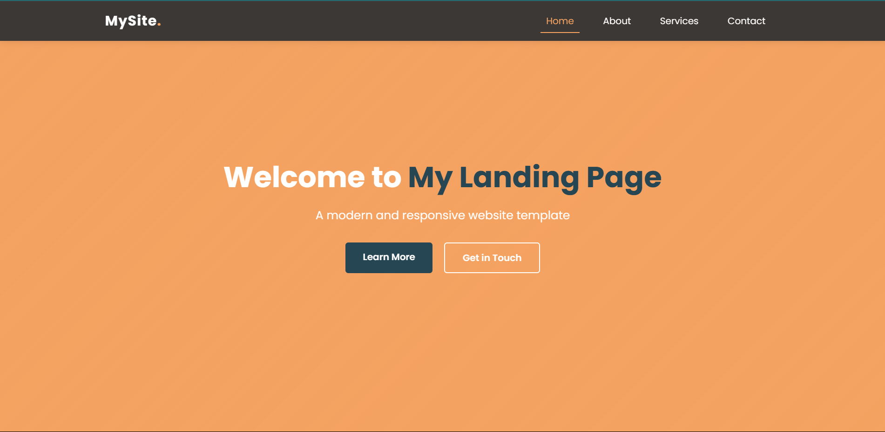
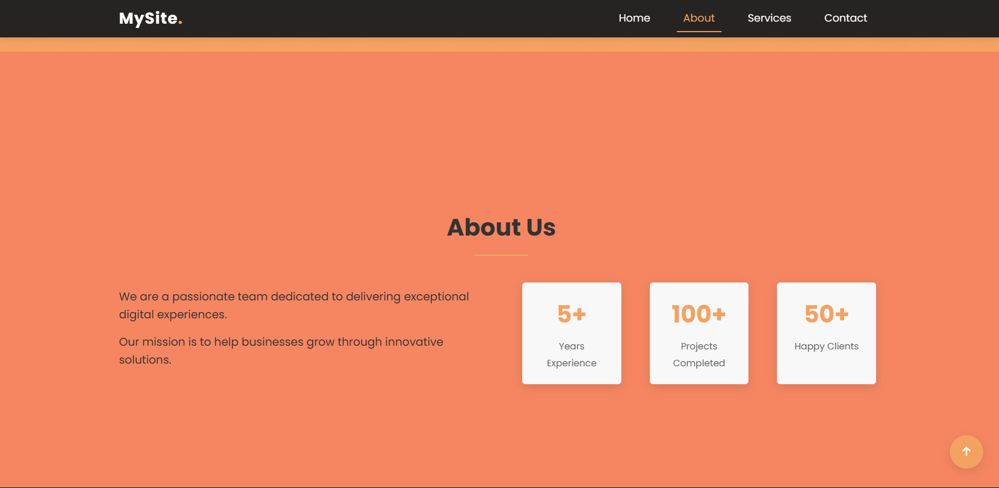
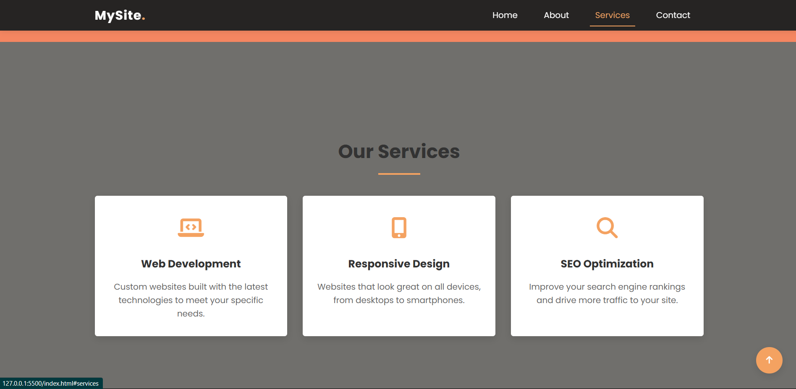
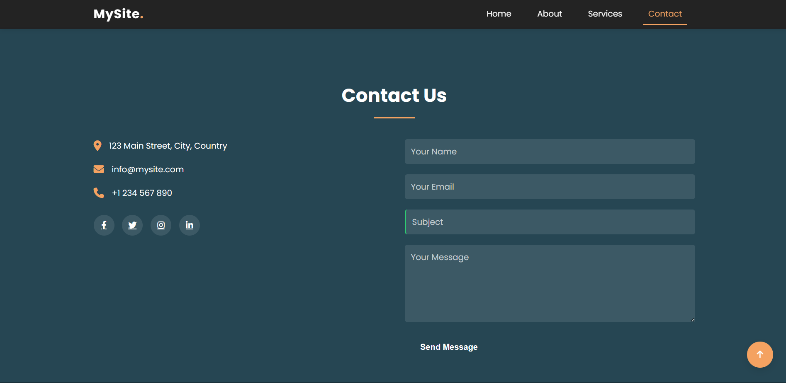

# Responsive Landing Page 🚀  

This is a **responsive landing page** with an **interactive navigation menu**, built as part of my internship at **Prodigy InfoTech**. The page adapts to different screen sizes and includes smooth scrolling effects.  

## 🔹 Features  
✅ Fully responsive design (works on desktop, tablet, and mobile). 
✅ Fixed navigation bar with hover effects.  
✅ Interactive menu that changes color on scroll.  
✅ Mobile-friendly hamburger menu. 

## 🛠️ Technologies Used  
- **HTML** for structure.
- **CSS** for styling.
- **JavaScript** for interactivity.


## 📷 Screenshots  
1. 


2. 


3. 


4. 


## 🚀 Live Demo  
Check out the live demo: **[GitHub Pages Link](https://github.com/mAdrls/PRODIGY_WD_01.git)**  

## 📌 How to Run Locally  
1. Clone this repository:  
   ```sh
   git clone https://github.com/mAdrls/PRODIGY_WD_01.git
